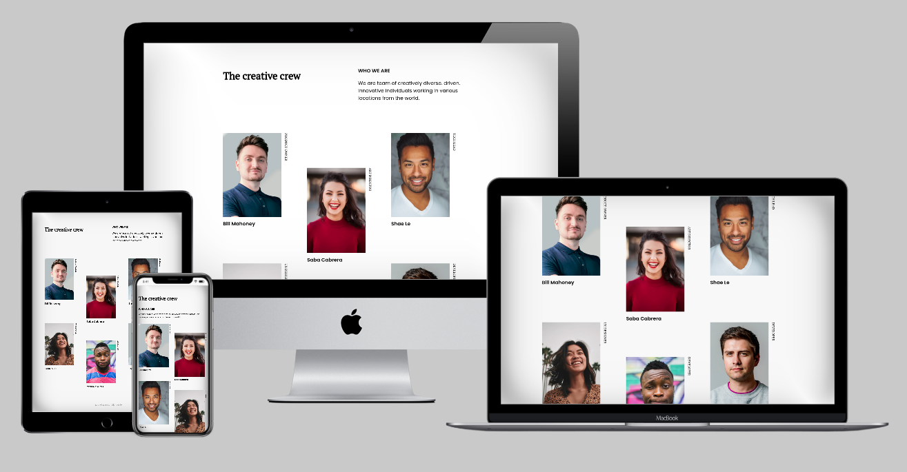

# Team Page

> A landing page showing a group of team members



## Built With

- Sass
- Flexbox

## Live Demo

[Live Demo Link](https://mapra99.github.io/teams-page/index.html)


## Setup & Usage

To get a local copy up and running follow these simple example steps.
1. Clone this repository and cd to its folder
```
git clone git@github.com:mapra99/gallery-lp.git
cd gallery-lp
```
1. Install dev dependencies
```
npm install --save-dev
```
3. Run a live server and go to http://localhost:8080
```
npm start
```
4. Watch sass for changes
```
npm run sass:watch
```

## Author

**Miguel Prada**

- Github: [@mapra99](https://github.com/mapra99)
- Twitter: [@MiguelPrada1](https://twitter.com/MiguelPrada1)
- Linkedin: [mprada](https://linkedin.com/in/mprada)

## Contributing

Contributions, issues, and feature requests are welcome!

Feel free to check the [issues page](issues/).

## Show your support

Give a star if you like this project!

## Acknowledgments

- devchallenges.io for their amazing designs and its community!

## License

This project is [MIT](lic.url) licensed.
